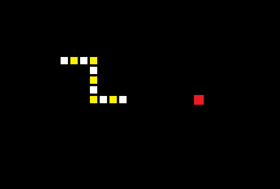

# rust_snake

[](https://crates.io/crates/rust_snake)

Snake game made in Rust



## Installation

If you're a **Rust programmer**, rust_snake can be installed with `cargo`.

```
$ cargo install rust_snake
```

## Building

`rust_snake` can be build from source code.

```
$ git clone https://github.com/AlexRiosJ/rust_snake.git
$ cd rust_snake
$ cargo build --release
```

## Usage

```
$ rust_snake
```

or if you built it from source

```
$ cargo run
```

### Controllers

- Use the arrows of the keyboard to move UP, RIGHT, DOWN or LEFT
